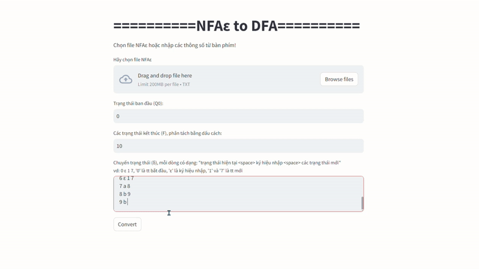

# Đồ án Tin học lý thuyết (CT121) trường CICT (CTU)
# Chuyển NFAε sang DFA, nhập các thành phần trực tiếp hoặc bằng file
# DEMO: [here](https://pmtai-automata.streamlit.app/)


## Cài đặt
1. Tải kho lưu trữ này về
```bash
git clone https://github.com/phanminhtai23/Automata_NFAe-to-DFA.git
cd Automata_NFAe-to-DFA
```
2. Tải các thư viện cần thiết
```bash
pip install -r requirements.txt
```
3. Khởi chạy hệ thống (streamlit run <đường dẫn đến file hệ thống>)
```bash
streamlit run main.py
```
